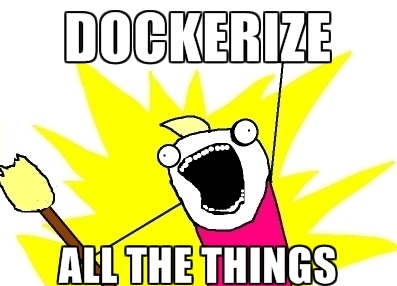
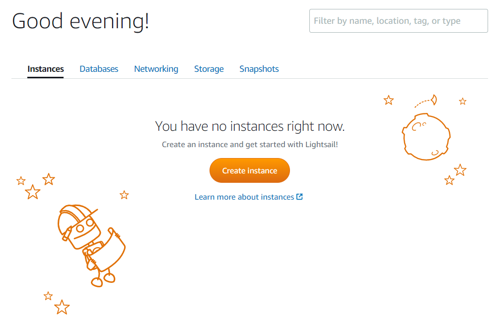
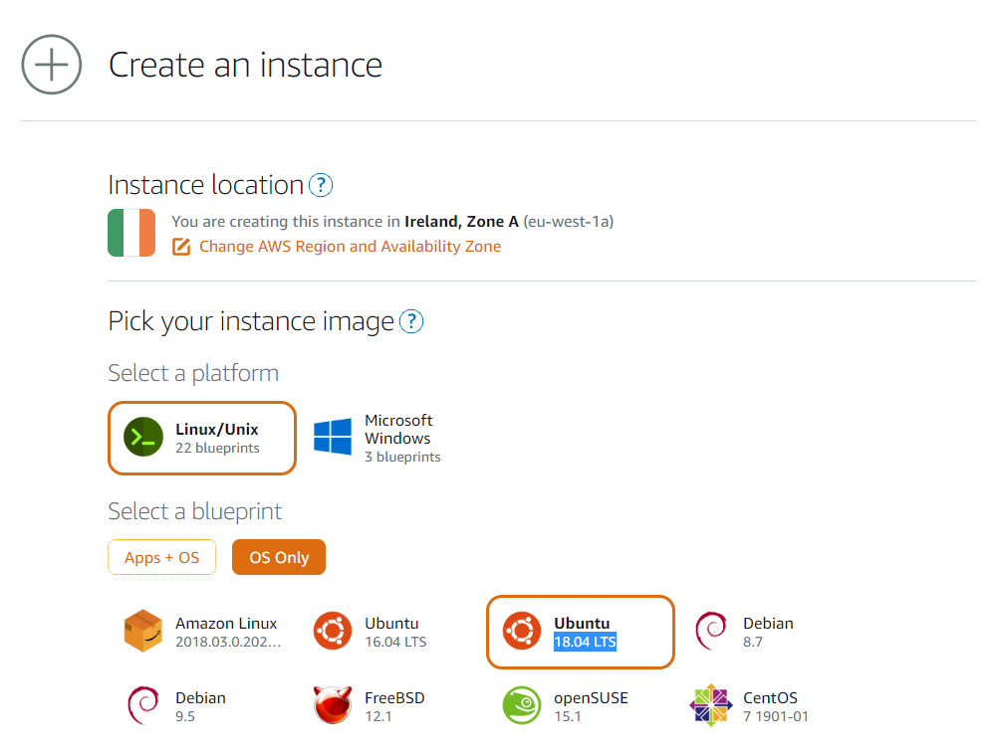
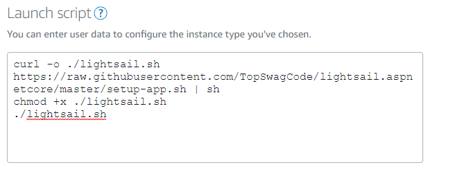
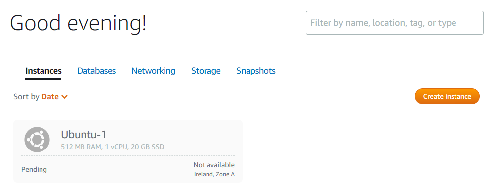
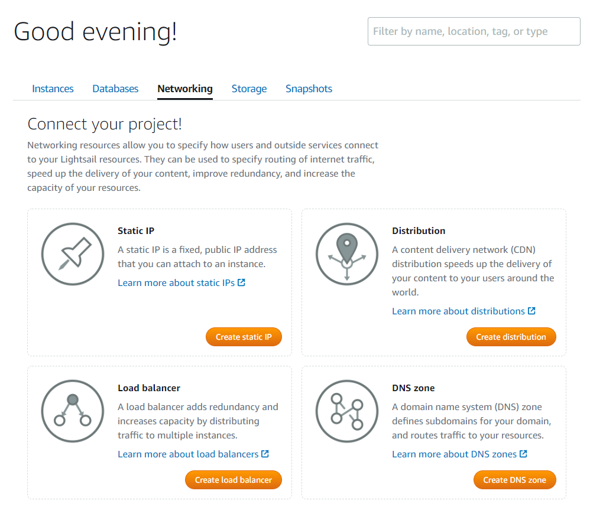
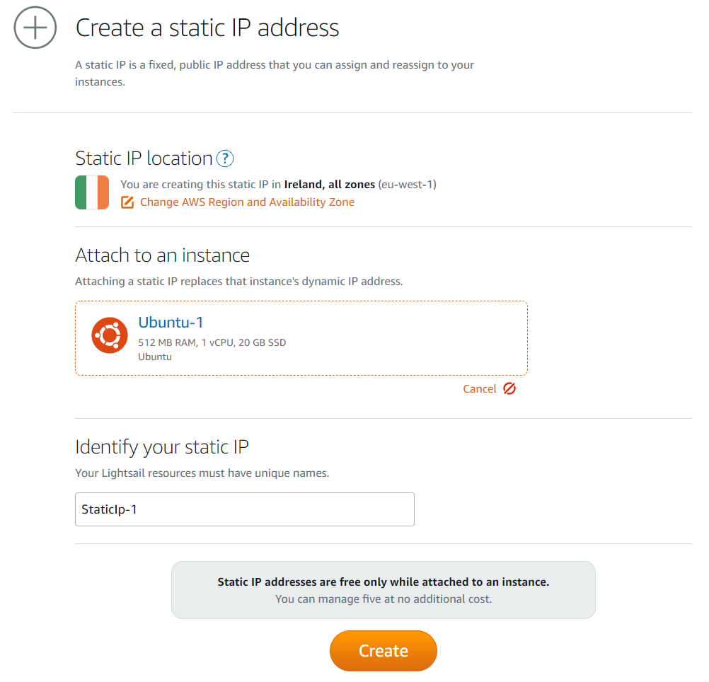
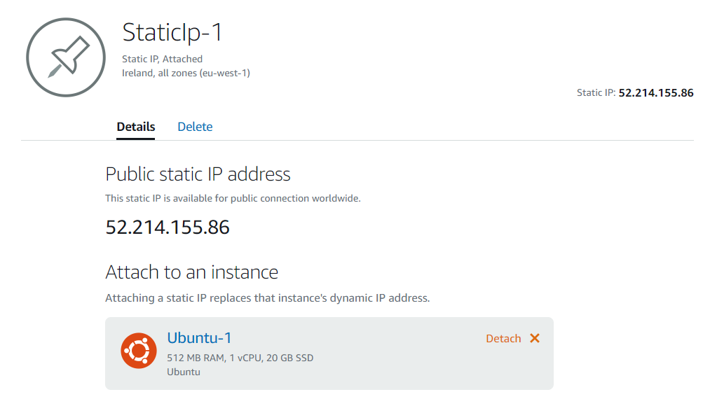
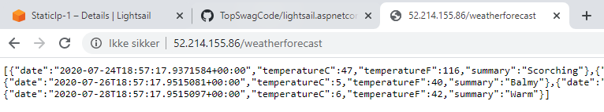

# lightsail.aspnetcore

This project will be based on the AspNet Core WebApi template. But feel free to use whatever floats your boat.

# Part 1 - Create the app.

I will be starting creating a new project from the commandline. 

```shell
$ dotnet new webapi
```

Running the project and visiting /weatherforecast will return random weather json like so:

```json
[{"date":"2020-07-24T18:48:40.5036107+00:00","temperatureC":45,"temperatureF":112,"summary":"Warm"},{"date":"2020-07-25T18:48:40.5036136+00:00","temperatureC":20,"temperatureF":67,"summary":"Warm"},{"date":"2020-07-26T18:48:40.5036143+00:00","temperatureC":-17,"temperatureF":2,"summary":"Cool"},{"date":"2020-07-27T18:48:40.5036149+00:00","temperatureC":-2,"temperatureF":29,"summary":"Chilly"},{"date":"2020-07-28T18:48:40.5036156+00:00","temperatureC":3,"temperatureF":37,"summary":"Freezing"}]
```

With the base project up and running there is only one thing left to do.



With the code running we can start creating our dockerfile, which will later be used by docker-compose to build and start our app.

I used this example to create my own dockerfile:
https://docs.docker.com/engine/examples/dotnetcore/

And you can see the result below here.

```dockerfile
FROM mcr.microsoft.com/dotnet/core/sdk:3.1 AS build-env
WORKDIR /app

# Copy csproj and restore as distinct layers
COPY *.csproj ./
RUN dotnet restore

# Copy everything else and build
COPY . ./
RUN dotnet publish -c Release -o out

# Build runtime image
FROM mcr.microsoft.com/dotnet/core/aspnet:3.1
WORKDIR /app
COPY --from=build-env /app/out .
ENTRYPOINT ["dotnet", "lightsail.aspnetcore.dll"]
```

With the dockerfile in place, we can now focus on creating a docker-compose.yml file. Again I used docs from docker own homepage to build it. I am sharing an advanced docker-compose.yml file which also shows how you could start a MsSQL database with your project. You can find it here: https://docs.docker.com/compose/aspnet-mssql-compose/

If you are starting from scratch like me you can just use the same on as me below here:

```docker-compose.yml
version: "3"
services:
    web:
        build: .
        ports:
            - "80:80"
```

To test it all out try and run the project using the docker-compose.yml file.

```shell
$ docker-compose -f "docker-compose.yml" up -d --build
```
You should then be able to visit the site again on port localhost.

# Part 2 - Create deploy scripts. 

There are 2 scripts to be created and 1 service description.

the first script is a simple wrapper script to download the other script, make it executable and run it.

```shell
#!/bin/bash
curl -o ./lightsail.sh https://raw.githubusercontent.com/TopSwagCode/lightsail.aspnetcore/master/setup-app.sh | sh
chmod +x ./lightsail.sh 
./lightsail.sh
```
The main script can be seen below here with comments describing the flow.

```shell
#!/bin/bash

# install latest version of docker the lazy way
curl -sSL https://get.docker.com | sh

# make it so you don't need to sudo to run docker commands
usermod -aG docker ubuntu

# install docker-compose
curl -L https://github.com/docker/compose/releases/download/1.21.2/docker-compose-$(uname -s)-$(uname -m) -o /usr/local/bin/docker-compose
chmod +x /usr/local/bin/docker-compose

# download source code from github and store it in /srv/docker
mkdir /srv/docker
curl -o /srv/docker/release.zip -LJO https://github.com/TopSwagCode/lightsail.aspnetcore/archive/master.zip
cd /srv/docker

# install Zip and unzip and move files into current folder
apt-get update
apt-get install zip unzip -qy
unzip release.zip
mv lightsail.aspnetcore-master/* .

# move linux service file to /etc/systemd/system/ and enable the service
mv docker-compose-app.service /etc/systemd/system/
systemctl enable docker-compose-app

# start up the application via docker-compose.
docker-compose -f docker-compose.yml up -d --build
```

Last we also need to include the service description used in the main script file.

```linux
[Unit]
Description=Docker Compose Application Service
Requires=docker.service
After=docker.service

[Service]
Type=oneshot
RemainAfterExit=yes
# match the below to wherever you copied your docker-compose.yml
WorkingDirectory=/srv/docker
ExecStart=/usr/local/bin/docker-compose up -d --build
ExecStop=/usr/local/bin/docker-compose down
TimeoutStartSec=0

[Install]
WantedBy=multi-user.target
```

# Part 3 - Deploy the app.

You will need a AWS account for this and head over to https://lightsail.aws.amazon.com/

If you don't have any prior instances, you will be welcomed by a screen similar to this.



You can go ahead and press "Create instance" and pick the following:

* Linux / Unix
* Blueprint -> OS Only
* Ubuntu 18.04 LTS



To automatic setup your app, scroll down to Launch script and copy/paste the content of launchscript.sh we created earlier.



You should now be able to see the instance you just created



It will take a couple of minutes for the instance to startup and setting up the app. While we wait I would recommend setting up a static up for it. If you ever stop / start the app chances are you are going to loose your ip and you would have to go into the console again to see your new up. So use a Static IP that comes free with your instances. Do note that Static IP are billed, if not assigned an instance. Lets jump over to the "Networking" tab in aws lightsail and create our self one of those fancy static ip's.



Just pick your instance from the dropdown and press "Create".



You can now see your new ip.



Depending your speed for creating the static ip, chances are that your instance is setup and ready for visitors! Just visiting your ip/weatherforecast to see if it is up and running.



With this setup, you should be able to reboot, stop/start your instance and it should start your app after a few minutes.